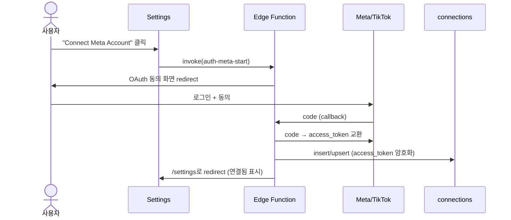

# Paid Ads Tracking Dashboard. Data Bridge

> ux-flow의 데이터 모델이 Supabase와 어떻게 연결되는지 설명.
> 컬럼 / 제약 / SQL은 `appendix-db-schema.md` 참조.

**입력**: [02-ux-flow.md § 데이터 모델 활용](./ux-flow/02-ux-flow.md), [appendix-screen-component-map.md](./appendix-screen-component-map.md)

## 1. 데이터 모델은 어떤 DB 테이블이 되나?

ux-flow의 사전을 그대로 인용.

| 데이터명 | 예상 테이블명 | 설명 (1줄) |
|---|---|---|
| Store | `stores` | 매장 마스터 (조지아/플로리다 매장 코드·지역·운영 상태) |
| AdAccount | `ad_accounts` | 플랫폼별 광고 계정 (Meta는 조지아/플로리다 분리, TikTok은 통합) |
| Campaign | `campaigns` | 캠페인/광고. 타겟 매장·기간·예산·목표를 갖는 핵심 엔티티 |
| PerformanceRecord | `performance_records` | 캠페인별 성과 지표 (수동 입력 또는 API 자동 수집) |
| Alert | *(없음 — 계산 전용)* | `campaigns`/`performance_records`를 읽어 매번 재계산, 저장 안 함 |
| Connection | `connections` | Meta/TikTok OAuth 연결 상태 — 서버 전용, RLS로 본인 행만 조회 |
| User | `auth.users` (Supabase 내장) | 로그인 사용자. 1인 운영 기준이며 모든 테이블의 `owner_id`가 참조 |

## 2. UX-flow의 어느 시점에 DB가 업데이트되나?

### 시나리오 1. 현황 파악

- **`/dashboard` 진입** → `campaigns`/`performance_records` R (KPI 집계). Alert는 그 자리에서 재계산, W 없음
- **카드 클릭 → Drawer** → `campaigns` 1 row R

### 시나리오 2. 신규 광고 등록

- **플랫폼/계정 선택** → `ad_accounts` R
- **매장 범위 선택** → `stores` R
- **저장** → `campaigns` W (insert)

### 시나리오 3. 알림 대응

- **배너/아이콘 확인 → 필터링 → Drawer** → R만 (Alert 저장 없음)
- **조치: 타겟 조정** → `campaigns` W (update)
- **조치 완료 인지** → 별도 W 없음. `performance_records.reported_at`이 채워지면 다음 조회 때 재계산 결과에서 자연히 빠짐

### 시나리오 4. 성과 입력 및 보고서 생성

- **Drawer "성과 입력" 탭 저장** → `performance_records` W (insert, `source='manual'`)
- **`/reports` 이동 → 필터** → `campaigns`/`performance_records` R
- **내보내기** → DB 동작 없음 (클라이언트 사이드)

### 시나리오 5. 매장 마스터 관리

- **`/stores` 이동** → `stores` R
- **매장 추가/수정 저장** → `stores` W (insert/update)

### 시나리오 6. 플랫폼 계정 연결 (신규)

- **"Connect Meta/TikTok Account" 클릭** → DB 동작 없음 (Edge Function이 OAuth 대행)
- **OAuth 콜백 완료** → `connections` W (insert/upsert, Edge Function의 service_role만 write)
- **Settings 화면 표시** → `connections_public`(토큰 제외 view) R
- **자동/수동 동기화** → `sync-campaigns`가 `campaigns` upsert(`external_campaign_id` 기준), `sync-performance`가 `performance_records` insert(`source='api'`)

## 3. 각 페이지는 어떤 DB와 연결되나?

| 페이지 | 다루는 테이블 | 동작 |
|---|---|---|
| Dashboard | `campaigns` + `performance_records` + `stores` + `ad_accounts` | R (Alert는 계산 전용, 저장 없음) |
| Campaign Register | `campaigns` + `stores` + `ad_accounts` | W (insert) + R (선택지) |
| Campaign Detail Drawer | `campaigns` + `performance_records` | R + W (update/insert) |
| Stores | `stores` | R + W |
| Reports | `campaigns` + `performance_records` | R |
| Settings | `connections_public`(view) | R (토큰 필드 없음 — 실제 `connections` write는 Edge Function 전용) |

## 4. 외부 의존 데이터의 라이프사이클

Connection(Meta/TikTok OAuth)만 외부 API에 의존한다. 나머지 엔티티는 단순 CRUD라 생략.

이후 `sync-campaigns`/`sync-performance` Edge Function이 `connections.access_token`을 읽어
Meta/TikTok API를 호출하고 `campaigns`/`performance_records`에 W (05-api-integration.md 참고).

## 5. 정합성 체크

- [x] § 1의 데이터명·테이블명이 ux-flow 사전(02-ux-flow.md § 데이터 모델 활용)과 글자 단위 일치
- [x] § 2의 단계가 ux-flow UX-flow 단계별 서사의 단계와 일치
- [x] § 3의 페이지명이 ux-flow 페이지 리스트의 행과 글자 단위 일치
- [x] § 4 시퀀스의 외부 의존(Meta/TikTok)이 ux-flow 시나리오 6의 트리거와 일치
- [x] 본문에 SQL/컬럼/제약/훅 코드 0건 (전부 `appendix-db-schema.md`로 분리 예정)

## 참고 — 소유권 모델 가정

모든 테이블의 `owner_id`는 `auth.uid()`를 가정한다(01-project-summary.md "대상 사용자: 1인 운영,
향후 팀원 합류 예정"). 팀 확장 시 `owner_id` → `team_id`로 승격하는 마이그레이션이 별도로
필요하며, 이 문서는 그 전까지의 1인 운영 기준으로 작성됐다.
