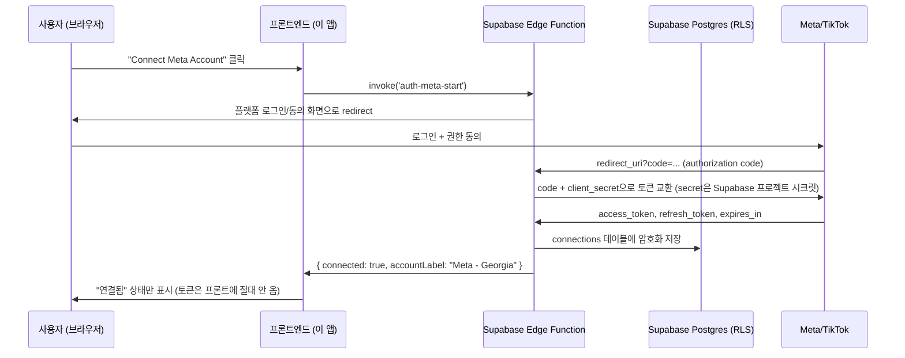

# 페이드 광고 트래킹 대시보드 — API Integration

> Meta/TikTok 광고 API를 실제로 연동하기 위한 실행 계획. 백엔드는 **Supabase**(Edge Functions + Postgres)로 구축한다 — 이 스타터킷에 이미 `/supabase-integration` 워크플로우가 갖춰져 있어 별도 서버를 새로 세울 필요가 없다. 01-project-summary.md 핵심 기능 #7("Meta/TikTok Ads API 자동 수집", 1차 범위 제외)을 실제로 켜는 문서다.

## 실행 순서

| 단계 | 내용 | 담당 |
|---|---|---|
| 1 | ~~02-ux-flow.md 작성~~ → 완료. 이미 존재하던 문서에 Connection 엔티티·externalCampaignId·source 필드·시나리오 6(계정 연결)을 추가 반영함 | 완료 |
| 2 | Meta for Developers / TikTok for Business 앱 등록 + App Review 신청 | 사용자 (외부 콘솔) |
| 3 | Supabase 프로젝트 생성 + DB 스키마·Auth·RLS 설계 | Claude + 사용자 승인 (`/supabase-integration` Phase 1~3) |
| 4 | Edge Function으로 OAuth 교환 + Meta/TikTok API 프록시 구현 | Claude (`/supabase-integration` Phase 6) |
| 5 | 프론트엔드를 mock 데이터에서 Supabase 클라이언트 호출로 전환 | Claude (`/supabase-integration` Phase 5, 데이터 훅) |
| 6 | 동기화 스케줄링 (pg_cron 또는 "Sync now" 온디맨드 호출) | Claude + 사용자 결정 |

## 아키텍처

- Edge Function이 이 문서의 "백엔드 프록시" 역할을 그대로 수행한다. 별도 Node/Express 서버·호스팅을 새로 마련할 필요가 없다.
- `service_role` 키와 client_secret은 Supabase 프로젝트 시크릿에만 두고, 프론트(`VITE_*`)에는 `anon key`만 노출한다(`supabase-integration` 스킬 원칙 #7, #11).

## 1단계 — 데이터 모델 확정 (완료)

`/supabase-integration`은 `02-ux-flow.md § 데이터 모델 활용`을 유일한 입력으로 읽는다. 이 문서는 이미 존재했고(시나리오 1~5, IA, 데이터 모델, 컴포넌트 리스트까지 상세히 작성돼 있었음), 여기에 API 연동에 필요한 항목만 추가했다:

- **핵심 엔티티**에 `Connection`(플랫폼 연결, 서버 전용) 추가
- `Campaign.externalCampaignId`, `PerformanceRecord.source` 필드 추가
- **시나리오 6: 플랫폼 계정 연결** 신규 추가
- IA에 `/settings`(계정 연결 관리) 추가
- 컴포넌트 리스트에 `ConnectionCard`(신규) 추가, 이미 구현된 `CampaignThumbnail` 반영

다음 단계(3단계 Supabase 스키마 설계)는 이제 이 갱신된 데이터 모델을 그대로 입력으로 쓸 수 있다.

## 2단계 — 플랫폼 앱 등록 (사용자가 직접)

| 플랫폼 | 할 일 | 결과물 |
|---|---|---|
| Meta | Meta for Developers에서 앱 생성 → Marketing API 제품 추가 → `ads_read` 권한 App Review 제출 | Client ID/Secret, 승인 대기 |
| TikTok | TikTok for Business에서 앱 생성 → Ads 권한 신청 | Client ID/Secret, 승인 대기 |

- 두 플랫폼 다 Redirect URI를 Supabase Edge Function URL로 등록한다 (예: `https://{project}.supabase.co/functions/v1/auth-meta-callback`).
- 발급받은 Client ID/Secret은 **Supabase 프로젝트 시크릿**으로 등록한다(`supabase secrets set`) — 코드/저장소에 커밋하지 않는다.
- App Review는 실제 사업자 인증이 필요한 외부 절차라 이 부분만은 사용자가 직접 진행해야 한다. 심사 대기 중에도 3~6단계는 mock 토큰으로 미리 구현/검증할 수 있다.

## 3단계 — Supabase 스키마

`/supabase-integration` 호출 시 아래 테이블이 반영되도록 02-ux-flow.md에 명시한다.

| 테이블 | 주요 컬럼 | 비고 |
|---|---|---|
| `connections` | `platform`, `account_id`, `access_token`(암호화), `refresh_token`, `expires_at` | RLS: 본인 행만 조회 가능, `service_role`만 write |
| `campaigns` | 기존 컬럼 + `external_campaign_id` | null이면 API로 안 들어온 수동 등록 캠페인 |
| `performance_records` | 기존 컬럼 + `source ('manual'\|'api')` | API 값 우선, 사용자 override 가능 |

## 4단계 — Edge Functions

| 함수 | 역할 |
|---|---|
| `auth-meta-start` / `auth-tiktok-start` | OAuth 인증 URL로 redirect |
| `auth-meta-callback` / `auth-tiktok-callback` | code → token 교환, `connections`에 저장 |
| `sync-campaigns` | 플랫폼 캠페인 목록 조회 → `campaigns` upsert |
| `sync-performance` | 플랫폼 insights/report 조회 → `performance_records` upsert(`source='api'`) |

## 5단계 — 프론트엔드 전환

- `usePaidAdsStore`를 localStorage 단독에서 Supabase 클라이언트 호출(`src/hooks/data/`)로 전환 — `component-work` 스킬로 "Connect Meta Account"/"Connect TikTok Account" 버튼과 연결 상태 UI를 만든다.
- mock 데이터(`paidAdsMockData.js`)는 Storybook 전용으로 남기고, 실제 페이지는 Supabase 훅을 사용하도록 분리한다.

## 6단계 — 동기화 스케줄

- **자동**: Supabase `pg_cron`으로 `sync-campaigns`(1일 1회), `sync-performance`(진행중 캠페인 매일 + 종료 후 7일간) Edge Function을 호출.
  → `00000000000002_sync_constraints_and_cron.sql`에 구현. 스케줄은 UTC 09:00 / 09:30(≈ 04:00~05:00 ET).
  Edge Function 호출에 필요한 프로젝트 URL·service_role 키는 레포에 두지 않고 Vault에서 읽는다 —
  **프로젝트 생성 후 SQL Editor에서 `vault.create_secret` 2줄을 1회 실행해야 cron이 동작한다**(해당 파일 주석 참조).
- **수동**: 헤더의 "Sync now" 버튼으로 즉시 Edge Function 호출 — App Review 승인 전이나 급할 때 유용. *(UI 미구현)*

## 성과 지표 필드 매핑

| 우리 필드 (`performance_records`) | Meta Graph API Insights | TikTok Report |
|---|---|---|
| `impressions` | `impressions` | `impressions` |
| `reach` | `reach` | `reach` |
| `clicks` | `clicks` (또는 `link_click`) | `clicks` |
| `spend` | `spend` | `spend` |
| `hookViews` | `video_p25_watched_actions` (근사치) | `video_watched_2s` |
| `heldViews` | `video_p100_watched_actions` | `video_watched_6s` |
| `engagements` | `post_engagement` | `likes` + `comments` + `shares` (합산) |
| `conversions` | `actions` 중 `offsite_conversion` 등 | `conversion` |

**TikTok 리포트 호출 방식** — 캠페인 목록(`campaign/get`)과 성과가 별도 엔드포인트다.
`report/integrated/get`에 `report_type=BASIC`, `data_level=AUCTION_CAMPAIGN`,
`dimensions=['campaign_id']`, `query_lifetime=true`로 요청한다(누적 스냅샷 — Meta insights와 의미를 맞춤).

- TikTok에는 Meta의 `post_engagement` 같은 캠페인 레벨 단일 합계 지표가 없어 상호작용 3종을 더해 근사한다.
  셋 다 응답에 없으면 `null`로 둔다 — "상호작용 0"과 "지표 미수신"을 구분하기 위함.
- TikTok은 HTTP 200에 body의 `code`로 실패를 알리고, `metrics` 배열에 해당 계정이 지원하지 않는
  지표명이 하나라도 있으면 리포트 전체가 실패한다. 실제 계정 첫 연결 시 `code`를 보고 목록을 확정할 것
  (`sync-performance/index.ts`의 `TIKTOK_METRICS`).

### TikTok 앱 스코프 (반드시 먼저 설정할 것)

개발자 콘솔 앱 상세 → **Authorization → Scope of permission**이 비어 있으면, OAuth 동의가
성공하고 토큰이 발급돼도 **모든 엔드포인트가 `code: 40001` "The access token lacks the
required scope"로 거부된다.** 동의 화면에 `Reporting`이 체크돼 보이는 것과 무관하다 —
실제 권한은 이 스코프 목록에서 나온다.

| 필요한 스코프 | 열리는 엔드포인트 |
|---|---|
| Ads Management → Campaign → **Read Campaigns** | `campaign/get` (sync-campaigns) |
| Reporting → **Consolidated Report** / **Ad Insight Report** | `report/integrated/get` (sync-performance) |

- 쓰기 스코프(Create and Update Campaigns 등)는 요청하지 않는다. 우리는 읽기만 하며,
  불필요한 쓰기 권한은 심사를 어렵게 하고 토큰 유출 시 피해를 키운다.
- 스코프를 바꾸면 **기존 토큰은 권한이 늘어나지 않는다.** 반드시 `auth-tiktok-start`로
  재인가해 새 토큰을 받아야 한다.
- 스코프 변경은 TikTok 재심사 대상이 될 수 있다(앱 상태가 `In review`로 전환).

### Basic Information → Advertiser redirect URL

`auth-tiktok-callback`의 전체 URL을 **글자 하나까지 일치하게** 등록해야 한다. `-start`를
넣거나 끝에 슬래시를 붙이면 인가 화면에서 `The redirect URI does not match the developer
app redirect URL`로 거부된다.

또한 `state`에는 JSON 같은 특수문자를 넣지 않는다 — 인가 화면이 502(System Error)로 죽는
사례가 있어 `auth-tiktok-start`는 accountId 슬러그만 평문으로 싣는다.

## 지금 바로 시작할 수 있는 것

- `/project-planning` 호출 → 02-ux-flow.md 작성 (위 표의 신규 엔티티 포함)
- Meta for Developers / TikTok for Business 앱 등록 + App Review 제출 (승인 대기 중에도 아래 항목 병행 가능)
- Supabase 프로젝트 생성 (무료 티어로 충분) → `/supabase-integration` 호출해서 스키마·Auth·RLS부터 진행

## 사용자가 직접 해야 하는 것 (외부 절차, 대행 불가)

- Meta/TikTok 개발자 계정 생성 및 앱 등록, App Review 제출
- Supabase 계정 생성, 프로젝트 시크릿에 Client ID/Secret 등록

## 참고

- 01-project-summary.md 핵심 기능 #7과 직접 연결된 문서 — 그 항목의 "1차 범위 제외"를 실제로 켜는 실행 계획
- `/supabase-integration` 스킬의 승인 게이트(Phase별)를 그대로 따른다 — 임의로 스키마/RLS를 즉흥 변경하지 않는다
